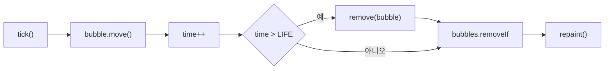

# bubble-pop 흐름

```mermaid
flowchart LR
  A["tick()"] --> B["bubble.move()"]
  B --> C["time++"]
  C --> D{"time > LIFE"}
  D -->|예| E["remove(bubble)"]
  E --> F["bubbles.removeIf"]
  D -->|아니오| F
  F --> G["repaint()"]
```
