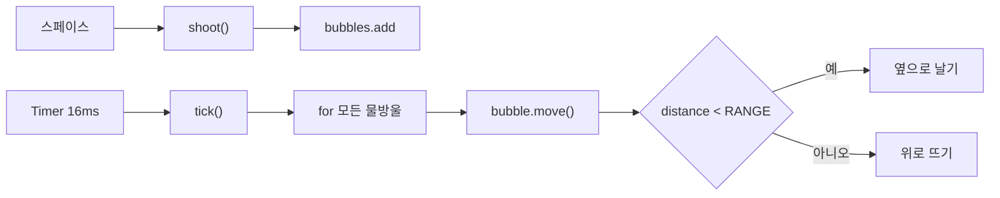

# bubble-shoot 흐름

```mermaid
flowchart LR
  A[스페이스] --> B["shoot()"]
  B --> C["bubbles.add"]
  D["Timer 16ms"] --> E["tick()"]
  E --> F["for 모든 물방울"]
  F --> G["bubble.move()"]
  G --> H{"distance < RANGE"}
  H -->|예| I[옆으로 날기]
  H -->|아니오| J[위로 뜨기]
```
