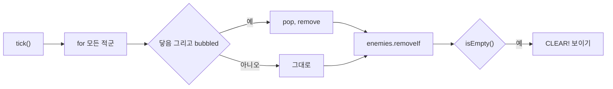

# enemy-pop 흐름

```mermaid
flowchart LR
  A["tick()"] --> B["for 모든 적군"]
  B --> C{"닿음 그리고 bubbled"}
  C -->|예| D["pop, remove"]
  C -->|아니오| E[그대로]
  D --> F["enemies.removeIf"]
  E --> F
  F --> G{"isEmpty()"}
  G -->|예| H[CLEAR! 보이기]
```
