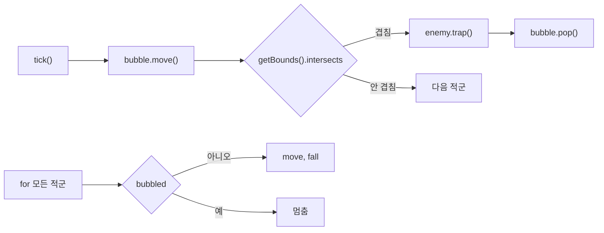

# enemy-trap 흐름

```mermaid
flowchart LR
  A["tick()"] --> B["bubble.move()"]
  B --> C{"getBounds().intersects"}
  C -->|겹침| D["enemy.trap()"]
  D --> E["bubble.pop()"]
  C -->|안 겹침| F[다음 적군]
  G["for 모든 적군"] --> H{bubbled}
  H -->|아니오| I["move, fall"]
  H -->|예| J[멈춤]
```
