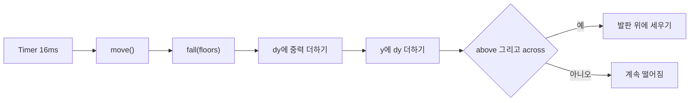

# floor-gravity 흐름

```mermaid
flowchart LR
  A["Timer 16ms"] --> B["move()"]
  B --> C["fall(floors)"]
  C --> D[dy에 중력 더하기]
  D --> E[y에 dy 더하기]
  E --> F{"above 그리고 across"}
  F -->|예| G[발판 위에 세우기]
  F -->|아니오| H[계속 떨어짐]
```
