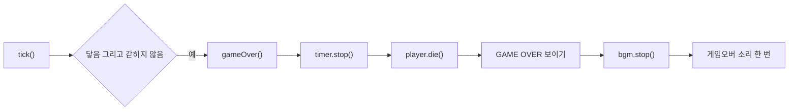

# game-over 흐름

```mermaid
flowchart LR
  A["tick()"] --> B{"닿음 그리고 갇히지 않음"}
  B -->|예| C["gameOver()"]
  C --> D["timer.stop()"]
  D --> E["player.die()"]
  E --> F[GAME OVER 보이기]
  F --> G["bgm.stop()"]
  G --> H[게임오버 소리 한 번]
```
