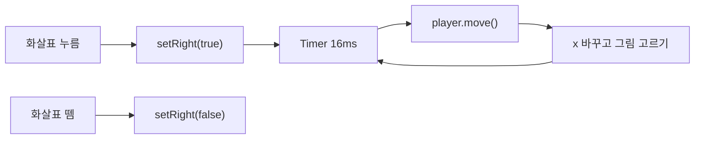

# player-move 흐름

```mermaid
flowchart LR
  A[화살표 누름] --> B["setRight(true)"]
  B --> C["Timer 16ms"]
  C --> D["player.move()"]
  D --> E[x 바꾸고 그림 고르기]
  E --> C
  F[화살표 뗌] --> G["setRight(false)"]
```
